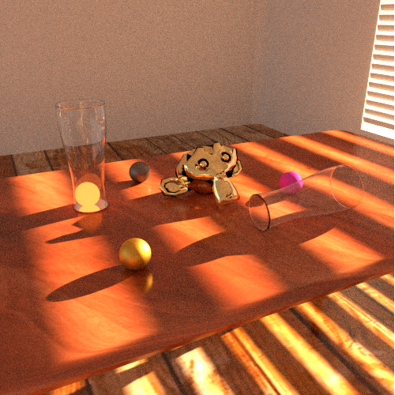

# Physically Based Rendering - Results
This repository will be used to post the results from my Physically Based Rendering class at Universidade Federal da Paraíba

# Activity 1: Use an existing renderer to create a scene

## Blender 2.82

This is a simple, kind of messy image. I'll study Blender a little further and research better materials (such as the gold in Suzanne, which is much better than the "gold" on the sphere) to create a more interesting, photorealistic scene, that I plan on using at the final project of the class.

