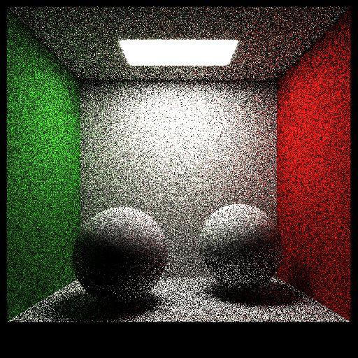

# Physically Based Rendering - Results
This repository will be used to post the results from my Physically Based Rendering class at Universidade Federal da Paraíba. My name is **Lucas Cafieiro Bittencourt Lima**, and I'm a Computer Science undergraduate.

# Activity 1: Use an existing renderer to create a scene

## Blender 2.81

This is a simple, kind of messy image. I'll study Blender a little further and research better materials (such as the gold in Suzanne, which is much better than the "gold" on the sphere) to create a more interesting, photorealistic scene, that I plan on using as the final project of the class.

This image was rendered using Cycles, with 1920x1080 pixels of resolution, and the path tracer was configured to use 1000 samples per pixel. The cups are using the default Glass BSDF as a material. The golden and the iron sphere were rendered using the default Glossy BSDF as a material. The pink sphere is using the default Diffuse BSDF as a material. The glowing sphere uses a Translucent BSDF as a material, with an Emission with 50.0 of strength. The Suzanne model uses a mix of two Glossy BSDFs as materials. Finally, the table and the floor both have a mix of a default Diffuse BSDF and a Glossy BSDF with a roughness value of 0.173. The light source outside the scene has a strenght of 1000.0.

# Activity 2: Render triangles on Raytracer

To be able to render a triangle on the Raytracer, I had to use a Ray-Triangle intersection algorithm. Although it's not the most optimized algorithm, I've used the one proposed by Peter Shirley. Here's a sample of what it looks like:

# Activity 3: Pinhole camera

The template given by our Professor implements an orthographic camera, which doesn't have depth. In order to render objects as the human eye perceives, I implemented a Pinhole camera. The results can be seen on the previous example, but also on the following example:

The objects are still being colored based on how far they are from the camera. Part of the project also required me to load 3D meshes, and that was done using Assimp. The following example shows Blender's Suzanne rendered:

Looking at Peter Shirley's book "Raytracing in One Weekend", he gives a nice equation to color objects based on their normals:

Then I added pixel sampling to my Raytracer, to achieve that "antialiasing" effect on the edges. Unfortunately, it messes up the colors:

# Final Activity & Results

After implementing some features and getting the Raytracer to run, it's time to create a Path tracer. After getting it to work for the first time, and having implemented diffuse materials and light sources, this is the first example:

The front sphere is a light source, and the back ones are being illuminated by it. To better see what it looks like, I drew a simple Cornell Box out of triangles and spheres. This first example was rendered using only 100 ray samples per pixel (spp), and a depth of 3 (which means the light that comes out of a surface interacts with 3 other pixels - and their surfaces):

Pretty sketchy, isn't it? Put by increasing the spp to 5000, this is the result (and by the way, at this point, the renderer is taking 10 minutes to finish rendering a scene):

After adding that diffuse material, I also added a smooth conductor material, which is a perfect mirror:

To speed up the process of rendering, I added multhreading support to my code, and I also implemented a data structure called Bounding Volume Hierarchy (or BVH) tree. To test how fast it was, I decided to go heavy on my final scene. My final scene took 22 hours (!) to finish rendering. It has a grand total of 1,713,266 triangles, a resolution of 1024x1024 and it uses all 3 materials I've implemented during this project: Diffuse, Light Source, and Smooth Conductor. The scene was also rendered with 10,000 spp and a depth of 3. There's also gamma compression, which makes the scene slightly brighter, to correct the color:

